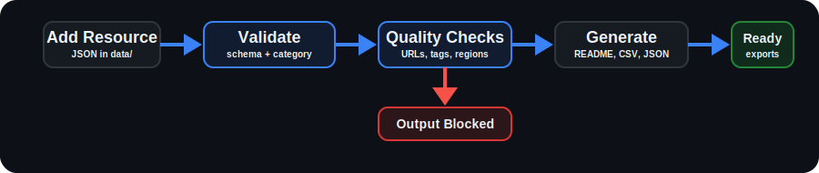

<!-- This README is generated by scripts/generate_readme.py. -->

# CS Resource Hub

**A curated, automated dataset of Canadian Computer Science student resources.**

 

 

  
  &nbsp;&nbsp;
  
  &nbsp;&nbsp;
  

  <strong>14 CS Opportunity Categories</strong> &nbsp;|&nbsp; <strong>Automated Validation</strong> &nbsp;|&nbsp; <strong>Multi-Format Exports</strong>

   

 

  

 

## Browse

Browse resources by area and category.

| Area | Categories |
| --- | --- |
| 📚 Learning & Development | [Learning Resources](#learning-resources) (47) [Interview Prep](#interview-prep) (26) [Communities & Clubs](#communities-clubs) (22) |
| 🏆 Experience | [Hackathons](#hackathons) (23) [CTFs](#ctfs) (15) [Game Jams](#game-jams) (11) [Competitions](#competitions) (14) |
| 🧩 Building & Open Source | [Open Source](#open-source) (37) [Useful Repositories](#useful-repositories) (0) [Project-Based Learning](#project-based-learning) (0) |
| 💼 Careers & Perks | [Internships & Fellowships](#internships-fellowships) (0) [Recruitment & Events](#recruitment-events) (0) [Certifications](#certifications) (0) [Free Developer Tools](#free-developer-tools) (0) |

## 📚 Learning & Development

### Learning Resources

**47 resources** · `learning-resources`

| Resource | Description | Type |
| --- | --- | --- |
| [A Tour of C++](https://www.stroustrup.com/tour3.html) | Modern introduction to C++ by Bjarne Stroustrup covering the language's core features and best practices. | Book |
| [Computer Networking: A Top-Down Approach](https://gaia.cs.umass.edu/kurose_ross/index.php) | Leading networking textbook covering the Internet, TCP/IP, HTTP, DNS, routing, wireless networking, and security. | Book |
| [Computer Systems: A Programmer's Perspective](https://csapp.cs.cmu.edu) | Comprehensive systems book covering C, architecture, assembly, memory, linking, concurrency, and performance. | Book |
| [Designing Data-Intensive Applications](https://dataintensive.net) | Industry-standard book on databases, distributed systems, scalability, reliability, and modern backend architecture. | Book |
| [Grokking Algorithms](https://www.manning.com/books/grokking-algorithms) | Beginner-friendly introduction to algorithms and data structures with visual explanations and practical examples. | Book |
| [Heard on the Street](https://www.amazon.com/Heard-Street-Quantitative-Questions-Interviews/dp/0994103867) | Classic book covering probability, brainteasers, and quantitative finance concepts. | Book |
| [Operating Systems: Three Easy Pieces](https://pages.cs.wisc.edu/~remzi/OSTEP) | Free operating systems textbook covering processes, threads, scheduling, synchronization, memory, and storage. | Book |
| [The Linux Command Line](https://linuxcommand.org/tlcl.php) | Comprehensive guide to the Linux command line, shell scripting, file systems, and essential command-line tools. | Book |
| [The Pragmatic Programmer](https://pragprog.com/titles/tpp20/the-pragmatic-programmer-20th-anniversary-edition) | Classic software engineering book covering practical programming techniques, best practices, and professional growth. | Book |
| [CS50x: Introduction to Computer Science](https://cs50.harvard.edu/x) | Harvard's intro CS course covering programming, algorithms, data structures, web development, and CS fundamentals. | Course |
| [Full Stack Open](https://fullstackopen.com/en) | A modern full-stack web development course covering React, Node.js, GraphQL, TypeScript, testing, CI/CD, and deployment. | Course |
| [GameDev.tv](https://www.gamedev.tv) | Game development courses covering Unity, Unreal Engine, C++, and C#. | Course |
| [Hack The Box Academy](https://academy.hackthebox.com) | Advanced cybersecurity platform with guided modules on pentesting, red teaming, Active Directory, Linux, and Windows. | Course |
| [KodeKloud](https://kodekloud.com) | Hands-on platform for learning DevOps, Kubernetes, Docker, Linux, Terraform, and cloud technologies. | Course |
| [Linux Journey](https://linuxjourney.com) | Interactive platform teaching Linux fundamentals, command line usage, permissions, networking, and administration. | Course |
| [Microsoft Learn](https://learn.microsoft.com) | Official Microsoft learning platform covering C#, .NET, Azure, PowerShell, Visual Studio, GitHub, and related tools. | Course |
| [OSSU Computer Science](https://github.com/ossu/computer-science) | A complete self-taught computer science curriculum using high-quality free online courses from leading universities. | Course |
| [SQLBolt](https://sqlbolt.com) | Interactive SQL tutorial teaching database fundamentals through hands-on exercises and real SQL queries. | Course |
| [TryHackMe](https://tryhackme.com) | Hands-on cybersecurity platform covering networking, Linux, penetration testing, web security, forensics, and defense. | Course |
| [Hacker News](https://news.ycombinator.com) | Community-driven technology news and discussions about software engineering, startups, CS, and programming. | News |
| [The Pragmatic Engineer](https://newsletter.pragmaticengineer.com) | Engineering newsletter covering software development, big tech, system design, leadership, and industry trends. | News |
| [TLDR Newsletter](https://tldr.tech) | Daily newsletter delivering concise summaries of software engineering, AI, cybersecurity, startups, and technology news. | News |
| [Bash Cheat Sheet](https://devhints.io/bash) | Concise Bash command reference covering shell scripting, variables, loops, pipes, and common commands. | Reference |
| [Docker CLI Cheat Sheet](https://docs.docker.com/get-started/docker_cheatsheet.pdf) | Official Docker quick reference covering the most common Docker CLI commands and workflows. | Reference |
| [Git Cheat Sheet](https://education.github.com/git-cheat-sheet-education.pdf) | Official GitHub one-page reference covering essential Git commands and workflows. | Reference |
| [HTTP Status Codes](https://developer.mozilla.org/en-US/docs/Web/HTTP/Reference/Status) | MDN reference explaining all standard HTTP response status codes with definitions and usage. | Reference |
| [Linux Commands Cheat Sheet](https://developers.redhat.com/cheat-sheets/linux-commands-cheat-sheet) | Official Red Hat reference for essential Linux commands used in development and system administration. | Reference |
| [MDN Web Docs](https://developer.mozilla.org) | The definitive reference for HTML, CSS, JavaScript, Web APIs, and modern web development maintained by Mozilla. | Reference |
| [PowerShell Cheat Sheet](https://ss64.com/ps) | Comprehensive PowerShell command reference covering cmdlets, operators, scripting, and administration. | Reference |
| [Compiler Explorer (Godbolt)](https://godbolt.org) | Interactive compiler explorer showing generated assembly, compiler optimizations, and output for many languages. | Tool |
| [CPUlator](https://cpulator.01xz.net) | Online CPU simulator for learning ARM, RISC-V, MIPS, Nios II, assembly language, architecture, and systems. | Tool |
| [Learn Git Branching](https://learngitbranching.js.org) | Interactive visual tutorial for learning Git commands, branching, merging, rebasing, and version control workflows. | Tool |
| [VisuAlgo](https://visualgo.net) | Interactive visualizations for algorithms and data structures including sorting, searching, graphs, trees, and heaps. | Tool |
| [ByteByteGo](https://www.youtube.com/@ByteByteGo) | System design channel covering scalable architecture, distributed systems, backend engineering, and design concepts. | Video |
| [Computerphile](https://www.youtube.com/@Computerphile) | Educational channel covering algorithms, cryptography, AI, networking, operating systems, and programming concepts. | Video |
| [Fireship](https://www.youtube.com/@Fireship) | Software engineering channel covering web development, cloud, AI, DevOps, programming languages, and modern tech. | Video |
| [Hussein Nasser](https://www.youtube.com/@hnasr) | Backend engineering channel covering databases, APIs, HTTP, networking, distributed systems, and architecture. | Video |
| [LiveOverflow](https://www.youtube.com/@LiveOverflow) | Cybersecurity channel covering reverse engineering, binary exploitation, web security, CTFs, and exploit development. | Video |
| [Low Level](https://www.youtube.com/LowLevelLearning) | Systems programming channel covering Linux, operating systems, reverse engineering, malware, and low-level computing. | Video |
| [The Cherno](https://www.youtube.com/@TheCherno) | High-quality C++ programming channel covering modern C++, game engine development, graphics, and systems programming. | Video |
| [The Organic Chemistry Tutor](https://www.youtube.com/@TheOrganicChemistryTutor) | Educational channel with lessons in calculus, linear algebra, statistics, discrete math, physics, and STEM subjects. | Video |
| [freeCodeCamp](https://www.freecodecamp.org) | Free interactive platform covering programming, web development, Python, databases, Git, APIs, AI, and projects. | Website |
| [LearnCpp](https://www.learncpp.com) | Comprehensive and continuously updated tutorial covering modern C++ from beginner to advanced topics. | Website |
| [LearnOpenGL](https://learnopengl.com) | Comprehensive tutorial for learning modern OpenGL, graphics programming, and rendering fundamentals. | Website |
| [Real Python](https://realpython.com) | High-quality Python tutorials, articles, projects, and guides covering beginner through advanced topics. | Website |
| [Refactoring.Guru](https://refactoring.guru) | Comprehensive resource for learning design patterns, refactoring, object-oriented design, and clean architecture. | Website |
| [roadmap.sh](https://roadmap.sh) | Community-driven learning roadmaps for software engineering, programming, DevOps, cybersecurity, AI, and system design. | Website |

### Interview Prep

**26 resources** · `interview-prep`

| Resource | Description | Type |
| --- | --- | --- |
| [Cracking the Coding Interview](https://www.crackingthecodinginterview.com) | Classic interview preparation book covering coding questions, technical concepts, and interview strategies. | Book |
| [Elements of Programming Interviews](https://elementsofprogramminginterviews.com) | Comprehensive interview preparation book featuring advanced coding problems and detailed solutions. | Book |
| [ByteByteGo System Design](https://bytebytego.com) | System design interview platform featuring books, courses, and real-world architecture case studies. | Course |
| [Grokking the Coding Interview](https://www.designgurus.io/course/grokking-the-coding-interview) | Pattern-based coding interview course teaching common algorithmic approaches used in technical interviews. | Course |
| [Grokking the Object-Oriented Design Interview](https://www.designgurus.io/course/grokking-the-object-oriented-design-interview) | Popular course teaching object-oriented design concepts commonly tested in software engineering interviews. | Course |
| [Coding Interview University](https://github.com/jwasham/coding-interview-university) | Complete self-study roadmap covering data structures, algorithms, systems, networking, databases, and interview prep. | Guide |
| [Jake's Resume](https://www.overleaf.com/latex/templates/jakes-resume/syzfjbzwjncs) | Popular LaTeX resume template widely used by computer science students and software engineers. | Guide |
| [System Design Primer](https://github.com/donnemartin/system-design-primer) | Comprehensive open-source guide to system design interviews covering scalability, databases, caching, and architecture. | Guide |
| [Tech Interview Handbook](https://www.techinterviewhandbook.org) | Comprehensive guide covering coding, behavioral, system design, resume, and interview preparation strategies. | Guide |
| [AtCoder](https://atcoder.jp) | Competitive programming platform offering high-quality contests and algorithm practice. | Platform |
| [Codeforces](https://codeforces.com) | Competitive programming platform with contests and algorithmic problems for technical interview practice. | Platform |
| [CodeSignal](https://codesignal.com) | Technical assessment platform widely used by companies for coding screenings and online assessments. | Platform |
| [Codewars](https://www.codewars.com) | Programming challenge platform for improving coding skills through community-created problems. | Platform |
| [Codility](https://www.codility.com) | Technical assessment platform used by employers to evaluate coding, algorithm, and programming skills. | Platform |
| [DesignGurus](https://www.designgurus.io) | Interview preparation platform for system design, coding interviews, object-oriented design, and behavioral prep. | Platform |
| [Exponent](https://www.tryexponent.com) | Platform for behavioral, system design, and technical interview preparation with expert guidance and mock interviews. | Platform |
| [HackerRank](https://www.hackerrank.com) | Coding interview and online assessment platform covering programming, SQL, AI, and technical hiring challenges. | Platform |
| [Hello Interview](https://www.hellointerview.com) | Interview preparation platform focused on system design, coding interviews, and technical interview strategies. | Platform |
| [Interview Query](https://www.interviewquery.com) | Interview preparation platform specializing in SQL, data science, analytics, and machine learning interviews. | Platform |
| [interviewing.io](https://interviewing.io) | Anonymous mock technical interviews with experienced software engineers from leading technology companies. | Platform |
| [LeetCode](https://leetcode.com) | Leading coding interview platform with thousands of algorithm, data structure, SQL, and system design problems. | Platform |
| [NeetCode](https://neetcode.io) | Structured coding interview platform featuring curated roadmaps, problem lists, video explanations, and practice plans. | Platform |
| [Pramp](https://www.pramp.com) | Free peer-to-peer mock interview platform for coding and technical interview practice. | Platform |
| [QuantGuide](https://www.quantguide.io) | Quant finance interview prep covering probability, statistics, mathematics, programming, and trading interviews. | Platform |
| [Overleaf](https://www.overleaf.com) | Online LaTeX editor for creating professional resumes, CVs, and technical documents. | Tool |
| [Resume Worded](https://resumeworded.com) | AI-powered resume and LinkedIn reviewer providing feedback to improve interview chances. | Tool |

### Communities & Clubs

**22 resources** · `communities-clubs`

| Resource | Description | Type |
| --- | --- | --- |
| [Concordia Game Development Club](https://www.concordiagamedev.ca) | Concordia game development student club for networking, workshops, and project collaboration. | Club |
| [SCS Concordia](https://scsconcordia.com) | Concordia student society for software engineering and computer science students. | Club |
| [Space Concordia](https://www.spaceconcordia.ca) | Concordia student organization for aerospace, robotics, embedded systems, software, and engineering projects. | Club |
| [CodeSupport](https://codesupport.dev) | Programming community for beginner-friendly coding help, debugging support, and developer discussion. | Discord |
| [CS Careers Discord](https://discord.gg/cscareers) | Computer science career community for internships, resumes, interviews, job searching, and career advice. | Discord |
| [DevCord](https://discord.gg/devcord) | Developer community for programming discussion, project support, collaboration, and career advice. | Discord |
| [The Odin Project](https://www.theodinproject.com/discord) | Web development community for code review, collaboration, project feedback, and career support. | Discord |
| [The Programmer's Hangout](https://discord.gg/programming) | Large programming community for coding help, software development discussion, and developer support. | Discord |
| [Hack Club](https://hackclub.com/slack) | Global student hacker community focused on coding projects, workshops, hackathons, and peer learning. | Organization |
| [r/compsci](https://www.reddit.com/r/compsci) | Computer science discussions covering algorithms, theory, research, and academia. | Reddit |
| [r/cscareerquestions](https://www.reddit.com/r/cscareerquestions) | Discussions on software engineering careers, internships, resumes, interviews, and job searching. | Reddit |
| [r/cybersecurity](https://www.reddit.com/r/cybersecurity) | Cybersecurity news, careers, tools, and security discussions. | Reddit |
| [r/datascience](https://www.reddit.com/r/datascience) | Data science careers, analytics, machine learning applications, and industry discussions. | Reddit |
| [r/devops](https://www.reddit.com/r/devops) | Cloud infrastructure, DevOps, automation, CI/CD, and platform engineering discussions. | Reddit |
| [r/gamedev](https://www.reddit.com/r/gamedev) | Game development discussions covering programming, design, engines, and publishing. | Reddit |
| [r/learnprogramming](https://www.reddit.com/r/learnprogramming) | Programming help, learning resources, and beginner-friendly discussions. | Reddit |
| [r/linux](https://www.reddit.com/r/linux) | Linux news, open-source software, system administration, and operating system discussions. | Reddit |
| [r/MachineLearning](https://www.reddit.com/r/MachineLearning) | Machine learning research, papers, projects, and technical discussions. | Reddit |
| [r/netsec](https://www.reddit.com/r/netsec) | Technical cybersecurity research, vulnerabilities, exploits, and defensive security. | Reddit |
| [r/programming](https://www.reddit.com/r/programming) | Programming news, software development discussions, and industry topics. | Reddit |
| [r/quant](https://www.reddit.com/r/quant) | Quantitative finance careers, interviews, mathematics, and algorithmic trading discussions. | Reddit |
| [r/softwareengineering](https://www.reddit.com/r/softwareengineering) | Software engineering practices, architecture, engineering culture, and industry discussion. | Reddit |

## 🏆 Experience

### Hackathons

**23 resources** · `hackathons`

| Resource | Description | Month | Location |
| --- | --- | --- | --- |
| [ConUHacks](https://conuhacks.io) | Hackathon by Concordia University, with cash and hardware prizes. | January | Montreal, Quebec |
| [DeltaHacks](https://deltahacks.com) | Hackathon by McMaster University, with cash and hardware prizes. | January | Hamilton, Ontario |
| [McHacks](https://mchacks.ca) | Hackathon by McGill University, with cash and hardware prizes. | January | Montreal, Quebec |
| [nwHacks](https://nwhacks.io) | Western Canada's largest hackathon at UBC, with cash and hardware prizes. | January | Vancouver, British Columbia |
| [UofTHacks](https://uofthacks.com) | Hackathon by University of Toronto, with cash and hardware prizes. | January | Toronto, Ontario |
| [QHacks](https://qhacks.io) | Hackathon by Queen's University, with cash and hardware prizes. | February | Kingston, Ontario |
| [TreeHacks](https://treehacks.com) | One of the world's largest hackathons, hosted at Stanford with major cash prizes and industry sponsors. | February | Stanford, California |
| [GenAI Genesis](https://genaigenesis.ca) | Canada's largest AI hackathon, by the University of Toronto, with cash and hardware prizes. | March | Toronto, Ontario |
| [Hack Canada](https://hackcanada.org) | Hackathon at Waterloo, with large cash prizes and industry sponsors. | March | Waterloo, Ontario |
| [LA Hacks](https://lahacks.com) | Hackathon by UCLA, one of the largest in the US, with large cash prizes and industry sponsors. | April | Los Angeles, California |
| [HackTheMountain](https://hackthemountain.ca) | Hackathon by UdeM and Polytechnique University, with cash and hardware prizes. | May | Montreal, Quebec |
| [MPC Hacks](https://mpchacks.com) | Inter-university hackathon, with cash and hardware prizes. | May | Montreal, Quebec |
| [SHacks](https://shacks.cc) | Hackathon by Université de Sherbrooke, with cash prizes. | May | Sherbrooke, Quebec |
| [Hack the 6ix](https://hackthe6ix.com) | Toronto's largest summer hackathon, with cash and hardware prizes. | July | Toronto, Ontario |
| [Hack the North](https://hackthenorth.com) | Canada's largest hackathon at University of Waterloo, with massive cash prizes and industry sponsors. | September | Waterloo, Ontario |
| [HackMIT](https://hackmit.org) | MIT's prestigious annual hackathon, with massive cash prizes and industry sponsors. | September | Cambridge, Massachusetts |
| [PennApps](https://pennapps.com) | Hackathon by the University of Pennsylvania, one of the original college hackathons, with cash prizes. | September | Philadelphia, Pennsylvania |
| [Cal Hacks](https://calhacks.io) | The world's largest collegiate hackathon, by UC Berkeley, with huge cash prizes and industry sponsors. | October | Berkeley, California |
| [CodeML](https://codeml.ca) | Machine learning hackathon by PolyAI and SEMLA at Polytechnique University, with cash prizes. | October | Montreal, Quebec |
| [FIAM-IA Hackathon](https://hackathonfiam-ia.com) | Finance and AI hackathon, with cash prizes and industry sponsors. | October | Montreal, Quebec |
| [HackHarvard](https://hackharvard.io) | Harvard's annual hackathon, with large cash prizes and industry sponsors. | October | Cambridge, Massachusetts |
| [CodeJam](https://codejam.mcgilleus.ca) | Hackathon by McGill Engineering, with cash prizes. | November | Montreal, Quebec |
| [HackUTD](https://hackutd.co) | University of Texas hackathon, with cash prizes and industry sponsors. | November | Dallas, Texas |

### CTFs

**15 resources** · `ctfs`

| Resource | Description | Month | Location |
| --- | --- | --- | --- |
| [UofTCTF](https://ctf.uoftctf.org) | CTF by the University of Toronto, with cash and software prizes. | January | Online |
| [NCC CTF Series](https://ncc-cnc.ca/ctfseries) | National student CTF series across Canada, with regional rounds and a Montreal final. | February | Online |
| [@HACK CTF](https://athackctf.com) | Canada's largest student CTF at Concordia University, with cash and hardware prizes. | March | Montreal, Quebec |
| [PolyPwnCTF](https://pwn.polycyber.io) | Student CTF by Polytechnique University, with cash and training prizes. | March | Montreal, Quebec |
| [PlaidCTF](https://plaidctf.com) | Global CTF by Carnegie Mellon University's PPP, with cash prizes and a DEF CON finals invite. | April | Online |
| [UMDCTF](https://umdctf.io) | Student CTF by the University of Maryland, with cash and software prizes. | April | Online |
| [DEF CON CTF](https://defcon.org) | Most prestigious CTF in the world, with online qualifiers and finals in Las Vegas. | May | Online |
| [NorthSec](https://nsec.io) | Multi-day paid CTF in Montreal for professionals, with cash prizes and a student track. | May | Montreal, Quebec |
| [Google CTF](https://capturetheflag.withgoogle.com) | Global CTF hosted by Google, with cash prizes and a final stage event. | June | Online |
| [Midnight Sun CTF](https://play.midnightsunctf.com) | Global CTF by HackingForSoju, with online qualifiers and finals in Stockholm. | June | Online |
| [HackTheBox Cyber Apocalypse](https://www.hackthebox.com/events/cyber-apocalypse-2026) | CTF by Hack The Box, with thousands of teams and a massive prize pool. | July | Online |
| [HITCON CTF](https://ctf.hitcon.org) | CTF hosted by HITCON, known for extreme technical difficulty and elite global competition. | August | Online |
| [CSAW CTF](https://csaw.io/ctf) | Student CTF by NYU, with online qualifiers and finals in New York City. | September | Online |
| [CyberSci](https://cybersecuritychallenge.ca) | Canadian student CTF with regional rounds and a national final in Ottawa. | November | Canada |
| [0CTF](https://ctf.0ops.sjtu.cn) | CTF hosted by Shanghai Jiao Tong University, known for research-grade challenges. | December | Online |

### Game Jams

**11 resources** · `game-jams`

| Resource | Description | Month | Location |
| --- | --- | --- | --- |
| [Global Game Jam Vancouver](https://ggjvancouver.ca) | A western Canadian Global Game Jam hub backed and mentored by Vancouver game studios. | January | Vancouver, BC |
| [McGameJam](https://www.mcgamejam.ca) | Quebec's largest game jam, hosted by McGill University featuring various industry sponsors. | January | Montreal, QC |
| [Chillennium Game Jam](https://chillennium.com) | The largest student-run collegiate game jam in the world, featuring various major industry sponsors. | February | College Station, TX |
| [Behaviour Interactive Game Jam](https://www.eventbrite.ca/o/18734564338) | Game jam hosted by Behaviour Interactive, featuring mentorship and networking opportunities with industry professionals. | April | Montreal, QC |
| [Ubisoft Game Lab Competition](https://montreal.ubisoft.com/en/our-commitments/education/game-lab-competition) | A 10-week annual game jam where students build game concepts and compete for over $55,000 in scholarships. | April | Montreal, QC |
| [TOJam (Toronto Game Jam)](https://www.tojam.ca) | One of Canada's longest-running game jams, attracting student developers and industry professionals. | May | Toronto, ON |
| [GMTK Game Jam](https://gamemakerstoolkit.com/jam) | The largest virtual game jam, with projects highlighted to millions of viewers through the creators YouTube channel. | July | Online |
| [Algoma Startup GameJam](https://algomau.ca/immxrsive-game-jam) | An intensive game jam focused on entrepreneurship, run in direct collaboration with Unity industry trainers. | September | Brampton, ON |
| [GAMERella Game Jam](https://gamerella.ca) | An over decade old annual game jam focusing on supporting marginalized game creators and aspiring game makers. | November | Montreal, QC |
| [GitHub Game Off](https://github.com/topics/game-off) | GitHub's annual month-long game jam celebrating open-source development. | November | Online |
| [Concordia Game Development Club Jams](https://www.concordiagamedev.ca/events) | Concordia's Game Development Club game jams, with new themes every year. | Ongoing | Montreal, QC |

### Competitions

**14 resources** · `competitions`

| Resource | Description | Month | Location |
| --- | --- | --- | --- |
| [Battlecode](https://battlecode.org) | MIT real-time strategy AI programming tournament competing for a $20,000+ prize pool. | January | Online |
| [Coveo Blitz](https://2026.blitz.codes) | AI bot competition by Coveo, where teams build intelligent bots and compete for cash prizes. | January | Canada |
| [Reply Code Challenge](https://challenges.reply.com) | Global multi-track competition featuring 6-hour team sprints across algorithms, cybersecurity, and AI agents. | March | Online |
| [WorldQuant International Quant Championship](https://www.worldquant.com/brain/iqc) | Three-stage global quantitative modeling tournament competing for a $100,000 prize pool and internship opportunities. | March | Online |
| [Canadian Team Programming Competition](https://www.ctpc.ca) | National synchronized data structure sprint focused on university pride and corporate sponsor recruiting loops. | April | Online |
| [Lan ETS](https://lanets.ca) | North America's largest student-run LAN party, with gaming competitions, cash prizes, and industry sponsorships. | May | Montreal, QC |
| [JDIS Games](https://jdis.ca) | Autonomous AI agent optimization tournament at UdeS competing for sponsor-backed cash and tech gear. | July | Sherbrooke, Quebec |
| [Akuna Capital Virtual Quant Trading Challenge](https://akunacapital.com/careers/job/7993921/akuna-capitals-2026-virtual-quant-trading-challenge?gh_jid=7993921) | Virtual trading challenge by Akuna Capital, for students interested in breaking into the quantitative finance industry. | August | Online |
| [Lux AI](https://www.lux-ai.org) | Multi-month visual reinforcement learning agent tournament competing for global rank and tiered cash pools. | October | Online |
| [Meta Hacker Cup](https://en.wikipedia.org/wiki/Meta_Hacker_Cup) | Global multi-round elimination competitive programming championship competing for a $20,000 top cash prize. | October | Online |
| [International Data Analysis Olympiad](https://idao.world) | Machine learning and big data analytics framework competition competing for tech gear and corporate internship pathways. | December | Online |
| [Citadel Student Competitions](https://www.citadel.com/careers/programs-and-events) | Elite quantitative finance competitions with data modeling, algorithm tournaments, and trading simulations. | Ongoing | Online |
| [TCS CodeVita](https://codevita.tcsapps.com) | Global programming contest by TCS for university students with online rounds and international finals. | Ongoing | Online |
| [Universal Cup](https://ucup.ac) | Multi-stage international team programming circuit for elite algorithmic and system optimization challenges. | Ongoing | Online |

## 🧩 Building & Open Source

### Open Source

**37 resources** · `open-source`

| Resource | Description | Type |
| --- | --- | --- |
| [Apache Software Foundation](https://apache.org) | Explore established open-source projects across servers, data systems, developer tooling, and infrastructure. | Organization |
| [Cloud Native Computing Foundation](https://www.cncf.io) | Find cloud-native projects for containers, orchestration, service meshes, networking, and observability. | Organization |
| [Eclipse Foundation](https://www.eclipse.org) | Explore developer tools, runtimes, IoT platforms, and frameworks maintained by open-source communities. | Organization |
| [Mozilla](https://www.mozilla.org) | Contribute to open web, browser, privacy, and internet health projects. | Organization |
| [OWASP](https://owasp.org) | Learn application security through open-source tools, standards, projects, and community resources. | Organization |
| [Bevy Engine](https://bevyengine.org) | Build games in Rust with a modern, data-driven open-source engine. | Project |
| [Blender](https://www.blender.org) | Create 3D art, animation, simulations, and tools in a large open-source project. | Project |
| [Docker](https://www.docker.com) | Learn container workflows and contribute to widely used developer infrastructure tools. | Project |
| [FastAPI](https://fastapi.tiangolo.com) | Build Python APIs with a modern framework used for production web services. | Project |
| [Git](https://git-scm.com) | Learn distributed version control and contribute to the software powering modern development. | Project |
| [GNOME](https://www.gnome.org) | Explore Linux desktop apps, libraries, accessibility tools, and user experience projects. | Project |
| [Godot Engine](https://godotengine.org) | Build 2D and 3D games with a beginner-friendly open-source engine. | Project |
| [Grafana](https://grafana.com/oss) | Explore dashboards, metrics, logs, and observability tools used in production systems. | Project |
| [Home Assistant](https://www.home-assistant.io) | Automate smart homes and contribute to a large Python-based IoT project. | Project |
| [Hugging Face](https://huggingface.co) | Explore open models, datasets, machine learning libraries, and AI developer tooling. | Project |
| [KDE](https://kde.org) | Contribute to Linux desktop apps, frameworks, and cross-platform user tools. | Project |
| [Linux Kernel](https://kernel.org) | Study operating system internals and contribute to core Linux infrastructure. | Project |
| [Neovim](https://neovim.io) | Customize and improve a fast, extensible editor used by many developers. | Project |
| [Nmap](https://nmap.org) | Learn network discovery and contribute to a respected security auditing tool. | Project |
| [OpenCV](https://opencv.org) | Build computer vision applications with a widely used C++ and Python library. | Project |
| [OpenStreetMap](https://www.openstreetmap.org) | Improve open map data used by apps, researchers, and communities worldwide. | Project |
| [OpenTofu](https://opentofu.org) | Learn infrastructure as code through an open Terraform-compatible project and ecosystem. | Project |
| [PostgreSQL](https://www.postgresql.org) | Explore database internals and contribute to a production-grade SQL system. | Project |
| [Project Jupyter](https://jupyter.org) | Explore interactive notebooks, scientific computing, and data science tools for research. | Project |
| [Prometheus](https://prometheus.io) | Learn metrics, monitoring, and alerting through a cloud-native observability project. | Project |
| [Qt](https://www.qt.io) | Build cross-platform desktop, mobile, and embedded apps with mature UI tools. | Project |
| [QuantLib](https://www.quantlib.org) | Explore pricing, risk, and quantitative finance models in open-source C++. | Project |
| [ROS](https://www.ros.org) | Build robotics software with reusable tools for sensors, control, and simulation. | Project |
| [scikit-learn](https://scikit-learn.org) | Learn machine learning algorithms through a widely used Python library. | Project |
| [Wireshark](https://www.wireshark.org) | Analyze network traffic and learn protocols with an industry-standard debugging tool. | Project |
| [Awesome for Beginners](https://github.com/MunGell/awesome-for-beginners) | Find beginner-friendly open-source projects organized by programming language and contribution difficulty. | Resource |
| [CodeTriage](https://www.codetriage.com) | Receive personalized beginner-friendly issues from open-source projects you choose and follow. | Resource |
| [First Contributions](https://firstcontributions.github.io) | Practice the GitHub contribution workflow with a beginner-focused tutorial and sample project. | Resource |
| [First Timers Only](https://www.firsttimersonly.com) | Find welcoming resources and projects for your first open-source contribution. | Resource |
| [GitHub Open Source Guides](https://opensource.guide) | Learn contribution workflows, maintainership, licensing, and community best practices for open source. | Resource |
| [Good First Issue](https://goodfirstissue.dev) | Find beginner-friendly GitHub issues across hundreds of active open-source projects. | Resource |
| [Up For Grabs](https://up-for-grabs.net) | Browse active projects seeking new contributors through beginner-friendly GitHub issues. | Resource |

### Useful Repositories

**0 resources** · `useful-repositories`

> No resources yet. Contributions are welcome.

### Project-Based Learning

**0 resources** · `project-based-learning`

> No resources yet. Contributions are welcome.

## 💼 Careers & Perks

### Internships & Fellowships

**0 resources** · `internships-fellowships`

> No resources yet. Contributions are welcome.

### Recruitment & Events

**0 resources** · `recruitment-events`

> No resources yet. Contributions are welcome.

### Certifications

**0 resources** · `certifications`

> No resources yet. Contributions are welcome.

### Free Developer Tools

**0 resources** · `free-developer-tools`

> No resources yet. Contributions are welcome.

## Contributing

Contributions keep this dataset useful and current.

1. Read [CONTRIBUTING.md](./CONTRIBUTING.md) and [ADDING_RESOURCES.md](./docs/ADDING_RESOURCES.md).
2. Run `make add` or pick the correct JSON file in `data/`.
3. Add one resource using [SCHEMA.md](./docs/SCHEMA.md) and [STYLE_GUIDE.md](./docs/STYLE_GUIDE.md).
4. Run `make validate`.
5. Open a pull request with a clear description.

## License

- Code and scripts: [MIT](./LICENSE)
- Dataset/content: [CC BY 4.0](./LICENSE-CC-BY)

Built for Canadian Computer Science students who want one reliable place to discover what to learn, join, build, attend, and apply for.

