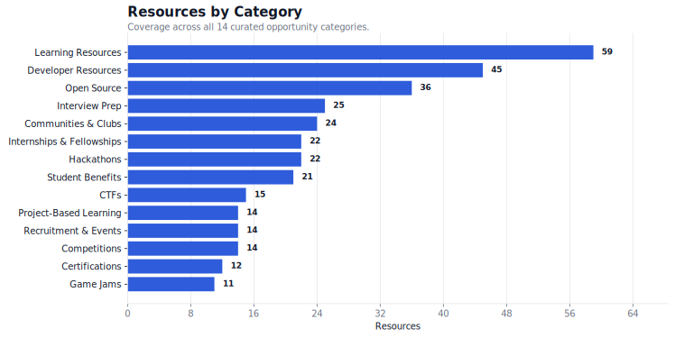
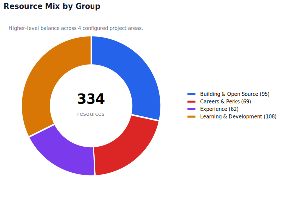
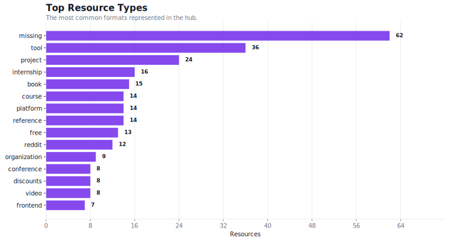
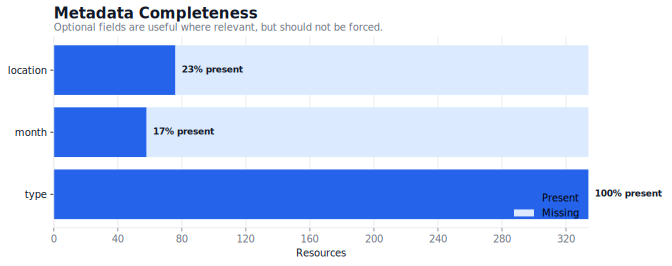
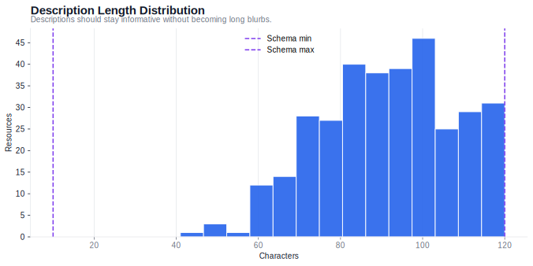
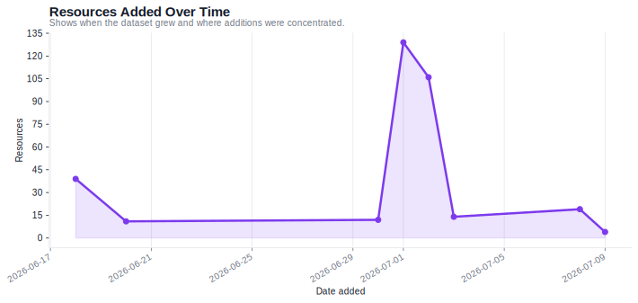
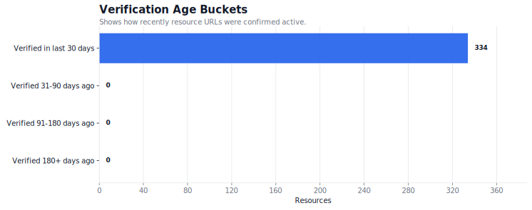
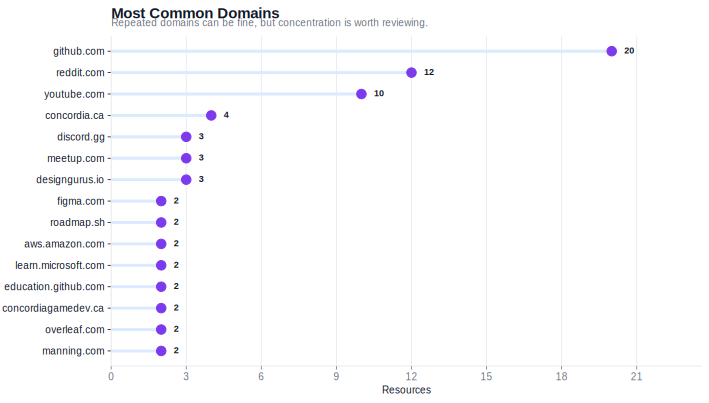

# CS Resource Hub EDA Report

A static, portfolio-friendly analysis of CS Resource Hub coverage, composition, metadata quality, duplicate candidates, and source concentration. The notebook in `notebooks/resource_eda.ipynb` keeps the exploratory workflow reproducible; this report is the polished read-only view.

Generated from `generated/all_resources.json` on 2026-07-09.

## Snapshot

| Metric | Value |
| --- | --- |
| Generated data date | 2026-07-09 |
| Total resources | 334 |
| Categories | 14 |
| Groups | 4 |
| Average description length | 85.8 chars |
| Duplicate URL candidates | 0 |

## Coverage

**Coverage signal:** Learning Resources is the strongest category with 59 resources, while Game Jams is the largest visible expansion opportunity with 11.

The group chart gives a fast read on whether the hub is balanced across learning, experience, building, and career-oriented resources.

### Largest Categories

| Category | Resources |
| --- | --- |
| Learning Resources | 59 |
| Developer Resources | 45 |
| Open Source | 36 |
| Interview Prep | 25 |
| Communities & Clubs | 24 |

### Smallest Categories

| Category | Resources |
| --- | --- |
| Game Jams | 11 |
| Certifications | 12 |
| Project-Based Learning | 14 |
| Recruitment & Events | 14 |
| Competitions | 14 |

## Resource Composition

This chart shows the dominant formats in the dataset, which helps avoid over-indexing on one kind of resource.

**Metadata signal:** 100% of resources include a type, and 23% include a location. Optional fields are tracked without forcing irrelevant metadata onto every entry.

| Field | Present | Missing |
| --- | --- | --- |
| type | 334 | 0 |
| month | 58 | 276 |
| location | 76 | 258 |

## Quality Signals

Description lengths stay inside the schema bounds, which keeps README tables scannable and avoids low-information entries.

The additions chart makes dataset growth visible and helps explain when large curation passes happened.

### Verification Age

Verification age buckets show how recently resource URLs were checked. They measure maintenance recency, not whether a source itself was recently updated.

| Bucket | Resources | Share |
| --- | --- | --- |
| Verified in last 30 days | 15 | 4.5% |
| Verified 31-90 days ago | 0 | 0.0% |
| Verified 91-180 days ago | 0 | 0.0% |
| Verified 180+ days ago | 0 | 0.0% |
| Future last_verified date | 319 | 95.5% |

| Check | Count |
| --- | --- |
| Duplicate IDs | 0 |
| Duplicate URLs | 0 |
| Duplicate names | 0 |
| Descriptions under 10 chars | 0 |
| Descriptions over 120 chars | 0 |
| Resources verified over 180 days ago | 0 |

## Source Concentration

**Domain signal:** `github.com` appears most often with 20 resources. Repeated domains are expected for high-quality hubs such as GitHub or YouTube, but concentration remains worth monitoring.

| Domain | Resources |
| --- | --- |
| github.com | 20 |
| reddit.com | 12 |
| youtube.com | 10 |
| concordia.ca | 4 |
| discord.gg | 3 |
| meetup.com | 3 |
| designgurus.io | 3 |
| figma.com | 2 |
| roadmap.sh | 2 |
| aws.amazon.com | 2 |

## Key Takeaways

- The dataset currently contains 334 resources across 14 categories.
- The largest category is Learning Resources with 59 resources.
- The smallest category is Game Jams with 11 resources.
- The most common domain is `github.com` with 20 resources.
- Duplicate URL candidates found: 0.

For deeper inspection or custom analysis, run `py -3 -m jupyterlab notebooks/resource_eda.ipynb`.
